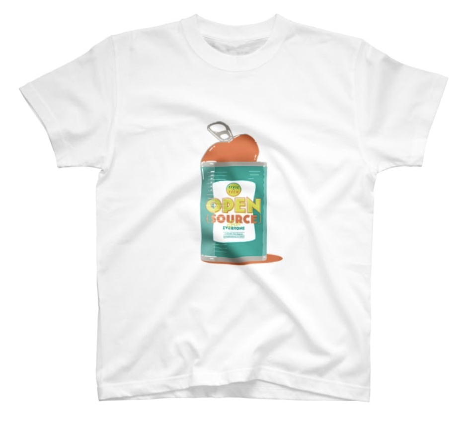

OSS T-shirt project
===
オープンソースのソース缶デザイン　 / Open Source Sauce Can Design　

Code for JapanがJapanが出展している2121 DESIGN SIGHTのルール？展にて販売しています。　 / Code for Japan is selling this T-shirt as goods at 2121 DESIGN SIGHT's "Rules? exhibition, which is available for purchase.　

オンラインの場合はhttps://suzuri.jp/code4japan にも掲載中。　/ It is also available online at https://suzuri.jp/code4japan.　

カラーを変更して、Code forコミュニティで他バージョンを生成できる場を準備中です。 / We are preparing a place where we can change the color and generate other versions in the Code for community.

